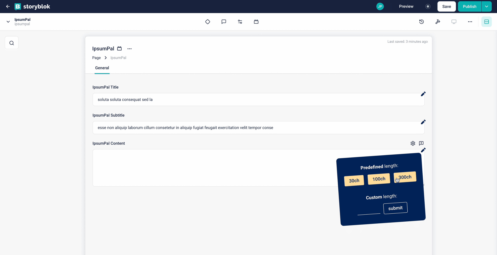

# IpsumPal Chrome Extension (1.0.0)

IpsumPal streamlines unhappy path tests by allowing character counts from 30 to 300 or custom values for Storyblok field population.

---

**IpsumPal** is a browser extension for Google Chrome, originally made by **Jeannine Prueger**. Its main purpose is to make unhappy path testing easier. **IpsumPal** identifies every [Storyblok](https://www.storyblok.com/) input field present on the current page. It provides a trio of pre-defined buttons, spanning character counts from 30 to 300. Additionally, there is the flexibility to set a custom word count according to anyone's preferences.

## How to use

---

Here's a step-by-step guide on how to utilize IpsumPal:

- ### Detecting Storyblok Input Fields:

  To initiate the process, open the popup by clicking on the designated button labeled "Detect Input". This action will trigger IpsumPal to identify all Storyblok input fields present on the page.

- ### Icon Indicators:

  Subsequently, you'll notice a small icon emerging in the upper right corner of each identified input field.

- ### Accessing Text Length Options:

  By clicking on the icon associated with a specific input field, a new popup will appear. Within this popup, you'll have access to a range of pre-defined or custom text lengths.

- ### Pre-Filled Text Lengths:

  Explore the pre-filled options that offer varying text lengths, such as 30 characters, 100 characters, and 300 characters. These options are conveniently presented as buttons.

- ### Custom Text Length:

  Should you require a specific text length beyond the pre-defined choices, IpsumPal allows you to set a custom word count.

- ### Automatic Text Selection:

  Upon selecting your desired text length, IpsumPal will automatically populate the input field with the corresponding content by adding a random lorem ipsum text.

- ### Saving the Page:

  Once the input fields are filled with the desired text, simply save the page. IpsumPal streamlines the process, reducing the effort needed for testing and content population.

## Download

---

**IpsumPal** is available at the Google Chrome Web Store

## Changelog

---

- 1.0.0 - 08/2023 - Initial version
